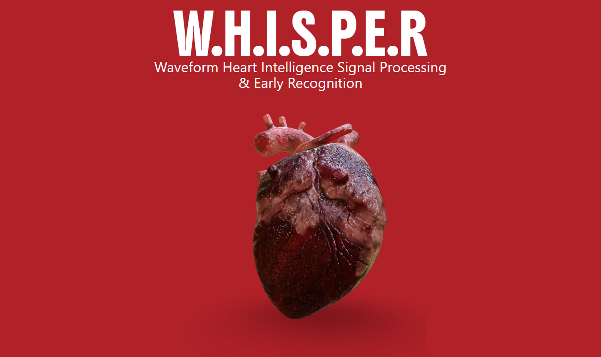
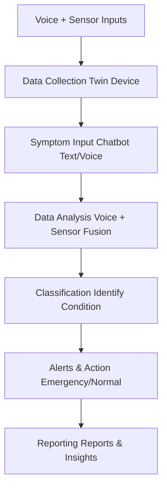

# W.H.I.S.P.E.R: Waveform Heart Intelligence Signal Processing & Early Recognition

  
*Revolutionizing cardiac health monitoring through AI-powered voice biomarkers and wearable sensors.*

---

## Project Overview

Heart disease remains one of the leading causes of death worldwide, primarily due to late detection and delayed medical attention. Many patients fail to recognize the severity of their symptoms, exacerbating their condition.

**W.H.I.S.P.E.R** addresses this critical gap by leveraging wearable sensors for continuous monitoring of vital signs (ECG, heart rate, oxygen levels, body temperature) and introducing innovative **Voice Cardiac Biomarkers** technology. This analyzes subtle micro-tremor patterns in voice (8–12 Hz frequencies) that reflect cardiac arrhythmias and stress levels. By fusing these multi-modal inputs, the system provides real-time risk assessment, early warnings, and actionable guidance—bridging the divide between symptom onset and medical intervention to potentially save lives.

**Domains:** Healthcare | Artificial Intelligence | Biomedical Signal Processing | NLP | Internet of Things (IoT) | Embedded Systems

This is a new project developed as part of the CS-406 Computer Engineering Final Year Design Project at the Department of Computer and Information Systems Engineering, NED University of Engineering and Technology.

---

## Objectives

- Develop a multi-modal biosensor platform integrating ECG, PPG, microphone, motion, and environmental sensors for continuous signal collection from wearables.
- Enable symptom description via voice or text inputs (Urdu/English) for enhanced accessibility.
- Design AI algorithms for micro-tremor pattern recognition from voice data to detect cardiac abnormalities.
- Implement Explainable AI (XAI) to classify symptoms as cardiac or non-cardiac with transparent reasoning.
- Classify specific heart conditions (e.g., arrhythmia, heart attack risk) using fused biosensor and voice data.
- Provide real-time risk scoring and precautionary guidance for timely decision-making.
- Generate medical reports summarizing symptoms, vitals, and detected risks.
- Recommend nearby specialized hospitals based on user location for high-risk cases.

---

## Scope

The project delivers a mobile/web application as the core interface for patients and healthcare professionals, enabling real-time cardiac health monitoring, analysis, and reporting. Key components include:

- **Voice Biomarker Engine:** A signal processing pipeline for continuous speech analysis to detect cardiac micro-tremors and early abnormalities.
- **Multi-Modal Sensor Integration:** Real-time vital acquisition from wearables (ECG, PPG) and environmental sensors.
- **AI/ML Pipeline:** Deep learning models for pattern recognition, anomaly detection, predictive analytics, risk scoring, and alerts. (Voice analysis uses transformer-based models like Wav2Vec 2.0; ECG uses CNN/ensemble techniques.)
- **Mobile/Web Interface:** User-friendly platform for visualizing vitals, downloading reports, and receiving alerts/hospital recommendations.

Initial deployment focuses on in-house testing and validation for accuracy. Post-trials, scaling for clinical use is planned.

---

## Methodology

### 1. Data Collection and Sensor Fusion
- **W.H.I.S.P.E.R Device** as the data hub captures:
  - Voice samples (Urdu/English speech).
  - Multi-modal signals: ECG, PPG, motion, oxygen saturation, temperature, environmental factors.
- Wearable sensors create a comprehensive physiological profile.
- Sensor fusion integrates signals into a unified dataset.

### 2. Symptom Input via Chatbot
- Multilingual chatbot for text/voice symptom description.
- Combines inputs with biosensor data to contextualize conditions, estimate severity, and identify cardiac vs. non-cardiac causes.

### 3. Voice Biomarker Analysis
- Detects micro-tremor patterns correlating with cardiac irregularities using advanced signal processing and ML:
  - 8–12 Hz: General cardiac stress.
  - 4–6 Hz: Arrhythmia (e.g., atrial fibrillation).
  - 12–15 Hz: Ventricular tachycardia risk.
- Voice "fingerprints" reflect autonomic nervous system responses.

### 4. Classification and Diagnosis
- Specialized module categorizes patterns into specific conditions.
- Real-time feedback on irregularities and risks.

### 5. Alert and Recommendation System
- Triggers alerts for severe conditions.
- Recommends nearest heart hospitals via geolocation.

### 6. Reporting and User Interface
- Smooth interface for risk scores, diagnostic reports, and health insights.
- Downloadable reports for consultations; feasible for anytime/anywhere use.

### System Architecture

---

## Deliverables

1. **W.H.I.S.P.E.R Core Hardware:** Integrated device with sensors and interface.
2. **Multilingual Chatbot:** Trained on cardiac symptoms and W.H.I.S.P.E.R signals.
3. **Risk/Health Assessment Reports:** Generated from patient vitals (severe/non-severe).
4. **Hospital Recommendations:** Nearest cardiac hospitals for severe detections.
5. **Explainable AI Integration:** With patient records for transparent insights.
6. **Voice Biomarkers Engine:** Micro-tremor detection via voice analysis.

---

## Technologies & Resources

### Hardware
- **Core Platform:** Raspberry Pi / ESP32.
- **Biomedical Sensors:**
  - ECG: AD8232 (12-lead), ADS1299 (8-ch ECG/EEG/EMG), MAX86150 (PPG + ECG).
  - Pulse Oximeter: MAX30102 (SpO₂, heart rate).
  - Temperature: MAX30205.
  - Bio-Impedance: AD5933 (hydration, tissue health).
- **Voice/Audio:** INMP441 Microphone, MAX9814 Amplifier.
- **Motion:** ADXL354 Accelerometer, MPU9250 IMU.
- **Environmental:** SHT30 (Temp/Humidity), SGP30 (Air Quality), BMP388 (Pressure).

### Software
- **NLP/Chatbot:** Hugging Face Transformers (Urdu/English support).
- **XAI Tools:** SHAP/LIME.
- **Interface:** React Native / Flutter / Streamlit.
- **Voice Analysis:** Wav2Vec 2.0 (fine-tuned for cardiac patterns), RNN/CNN for spectrograms.
- **ECG Analysis:** CNN or ensemble deep learning models.

### Data Sources
- Clinical ECG: Open-source datasets from Multan Research Center and Jinnah Hospital.
- Voice Biomarkers: Kaggle recordings of cardiac patients.

---

## Project Team

| No. | Name          | Seat No. |
|-----|---------------|----------|
| 1   | Sanya Sajid   | CS-22105 |
| 2   | Fatima Kashif | CS-22109 |
| 3   | Farzam Nasir  | CS-22137 |
| 4   | Hamza Ali     | CS-22146 |

**Supervisor:** Engr. Muhammad Ali Akhtar (Lecturer, Department of Computer and Information Systems Engineering, NEDUET)

---

## Timeline (Gantt Chart Summary)

| Phase                          | Aug-Sep | Oct-Dec | Jan-Mar | Apr-Jun | Jul |
|--------------------------------|---------|---------|---------|---------|-----|
| Research & Analysis            | ●      |         |         |         |     |
| Data Collection                | ●      | ●       |         |         |     |
| Sensors Integration            |         | ●       | ●       |         |     |
| Classification Algorithm (CNN/DL) |     | ●       | ●       |         |     |
| Micro-Tremor Detection Engine  |         | ●       | ●       |         |     |
| Alert/Risk Assessment Engine   |         |         | ●       | ●       |     |
| Chatbot Training & RAG         |         |         | ●       | ●       |     |
| Reporting/UI (Web/App)         |         |         |         | ●       | ●   |
| Testing & Debugging            |         |         |         | ●       | ●   |
| Hardware Maintenance           |         |         |         |         | ●   |

*Project Duration: August 2025 – July 2026*

---

## Alignment with SDGs

- **Good Health and Well-Being (SDG 3):** Early detection saves lives.
- **Quality Education (SDG 4):** Advances biomedical AI knowledge.
- **Decent Work and Economic Growth (SDG 8):** Fosters innovation in healthcare tech.
- **Industry, Innovation, and Infrastructure (SDG 9):** IoT/embedded systems development.
- **Reduced Inequalities (SDG 10):** Multilingual accessibility for diverse users.

---

##  References

- Voice Assessment and Vocal Biomarkers in Heart Failure: A Systematic Review.
- ECG-Chat: A Large ECG-Language Model for Cardiac Disease Diagnosis.
- Real-Time ECG Monitoring and Disease Detection.
- Artificial Intelligence–Driven Voice Biomarkers for Health.

---

## Getting Started

### Prerequisites
- Python 3.8+ for ML models.
- Node.js for web/app interface.
- Raspberry Pi/ESP32 setup for hardware prototyping.

### Installation
1. Clone the repo: `git clone https://github.com/yourusername/WHISPER.git`
2. Install dependencies: `pip install -r requirements.txt`
3. Set up hardware: Connect sensors to Raspberry Pi via GPIO.
4. Run the app: `npm start` (for web) or `flutter run` (for mobile).

### Usage
- Pair wearable device via Bluetooth.
- Input symptoms via chatbot.
- Monitor real-time vitals and receive alerts.

For detailed setup, see [docs/SETUP.md](docs/SETUP.md).

---

## Contributing

Contributions welcome! Fork the repo, create a feature branch, and submit a PR. See [CONTRIBUTING.md](CONTRIBUTING.md) for guidelines.

## License

This project is licensed under the MIT License - see [LICENSE](LICENSE) for details.

---

 
*Contact: [hamzaaly105@gmail.com](mailto:hamzaaly105@gmail.com)*  

  
